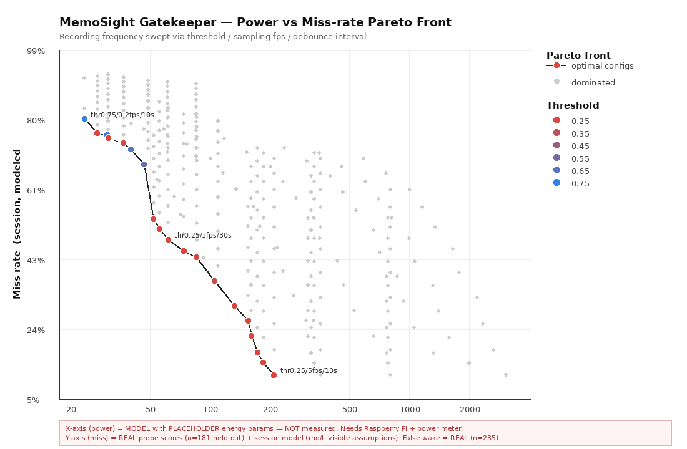

# 导师问题 3 — 记录频率的功耗 / 准确率权衡：Pareto 曲线方法学

> **Summary (EN).** Method for the power-versus-missed-capture trade-off curve. Translates
> "how often should it record" into three tunable knobs (threshold, sampling rate, debounce
> interval) and sweeps 396 configurations. Opens with an explicit真/假 stratification table:
> the per-frame miss and false-wake rates are measured on held-out probes, the
> frame-to-segment model is assumption-bearing, and the absolute power axis is a placeholder
> pending hardware instrumentation — **curve shape trustworthy, absolute values not**.

**2026-07-28框架：`scripts/pareto_framework.py`**
产物：`outputs/pareto_sweep.csv`（396 个配置）、`outputs/pareto_power_vs_miss.png`（样例图）

> ## 数据真假分层（读任何数字前先看这里）
> | | 内容 | 状态 |
> |---|---|---|
> | ✅ **真实** | 每帧漏报率 / 误唤醒率随阈值的变化 | 当前守门员在**固定 held-out 探针**上的实测分数（181 + 235 张，int8 部署口径，零泄漏核验） |
> | 🔶 **模型** | 单帧漏报 → 整段漏报；去抖影响；场景先验 | 结构可辩护，但含**显式假设**，需真实录像标定（H7） |
> | ⚠️ **占位** | 功耗轴的**绝对值** | **不是实测**，待 Pi + 功耗计（H1/H6）。**曲线形状可信，绝对值不可信。** |

---

## 0. 导师问题的翻译

> 「长时间看屏幕，但只想记关键信息 —— 记录频率怎么选？」

"记录频率"是产品语言。要用数据回答，先把它翻译成**可调的旋钮**和**可测的指标**：

**三个旋钮**（都是软件参数，不需要改模型）：

| 旋钮 | 物理含义 | 调高会怎样 |
|---|---|---|
| **触发阈值** `threshold` | 守门员多有把握才算"值得记" | 更保守：误唤醒↓、漏报↑ |
| **采样率** `fps` | 守门员每秒看几眼（占空比） | 更勤快：漏报↓、常开功耗↑ |
| **去抖间隔** `debounce` | 两次重处理之间的最小间隔 | 更省：功耗↓、可能漏掉紧接着出现的新屏 |

**三个指标**：

| 指标 | 定义 | 为什么重要 |
|---|---|---|
| **漏报率** miss | 该记的屏幕没记下来的比例 | **这是产品的命门**——漏掉 = 永久丢失这段记忆 |
| **功耗** power | 平均功耗 = 常开守门员 + 触发×重处理 | 决定续航，是"常开可穿戴"的立项前提 |
| **误唤醒率** false-wake | 不该记的画面触发了昂贵重处理的比例 | 白耗电 + 产生垃圾 memory card |

**没有唯一最优解**——这正是要画 Pareto 曲线的原因：给出"哪些配置是不被支配的"，让工作点成为**可解释的选择**而不是拍脑袋的常数。

---

## 1. 三个指标怎么算

### ① 漏报率 —— 两层，第一层是真数据

**第一层（✅ 真实）：每帧漏报率**
直接来自当前守门员在 `person_screen` 探针（181 张 GT=记）上的真实分数：

```
miss_frame(thr) = 分数 < thr 的比例 = 1 − recall
```

**第二层（🔶 模型）：整段漏报率** —— 一块屏在视野里停留一段时间，守门员会看它很多次。

这里**刻意没用**教科书式的独立试验模型（`miss^k`）。那个模型会给出荒谬结论：
多看几次漏报就趋近 0。现实不是这样——**有些屏幕是系统性漏的**：
守门员对它的打分本来就远低于阈值，看一百次还是判错一百次。

改用**逐屏分数**建模（这也是为什么要用探针的**逐张分数**而不是聚合率）：

```
一块屏 i 的探针分数 s_i = 它的"固有难度"
不同视角/抖动带来分数扰动 σ
  单次看漏它的概率     = Φ((thr − s_i) / σ)
  连看 k_eff 次全漏     = Φ((thr − s_i) / σ) ^ k_eff
  整段漏报率            = 对所有屏取平均
```

- `k_eff = 1 + (k − 1)(1 − ρ)`，`k = fps × 停留时长`。ρ 是帧间相关系数：
  连续帧几乎是同一张图，判错高度相关。**ρ=0.9 是保守假设**（宁可高估漏报）。
- σ→0 时模型自动退化为每帧漏报率，**漏报有地板**（分数远低于阈值的屏永远漏）——这是正确行为，
  也是这个模型比 `miss^k` 强的地方。

**假设清单（都要用真实录像标定，H7）**：`σ=0.10`、`ρ=0.9`、屏幕停留 `20s`、场景先验 `p_screen=0.15`。

### ② 误唤醒率（✅ 真实）

来自 `person_noscreen` 探针（235 张 GT=不记）的真实分数：`false_wake(thr) = 分数 ≥ thr 的比例`。
这**完全是软件评估**，不需要任何硬件。

### ③ 功耗（⚠️ 占位参数 + 真实结构）

```
平均功耗 = 板子本底 + fps × 每tick能耗 + 触发率 × 每次重处理能耗
（单位换算：mJ/s == mW，所以"次/秒 × mJ/次"可以直接当 mW 相加）

触发率 = fps × [ p_screen × recall + (1 − p_screen) × false_wake ]，再被去抖封顶到 1/debounce
```

**触发率这个公式把三个指标缝在了一起**：阈值降低 → recall↑（漏报↓）但 false_wake↑ → 触发率↑ → 功耗↑。
这就是权衡的数学来源，**不是人为设计的**。

每次重处理的能耗直接引用**任务B** 的两条路径（`--trigger-path X|Y`），保证两个框架口径一致：
任务B 测出真值后，本框架的功耗轴自动跟着变真。

---

## 2. 怎么读这张图



- **每个灰点** = 一个 (阈值, fps, 去抖) 配置（共扫了 11×6×6 = **396** 个）。
- **彩色点 + 黑线** = **Pareto 前沿**：不存在另一个配置在功耗和漏报上都不差、且至少一项更好。
  灰点全是**被支配的**——有更好的配置在等着，选它们纯属浪费。
- **颜色 = 阈值**（红=0.25 爱记 → 蓝=0.75 保守）。
- **横轴用对数**，因为可控功耗跨了两个数量级（十几 mW ~ 几千 mW）。
- **横轴是"可控功耗"= 总功耗 − 板子本底**，即这三个旋钮**真正能控制的那部分**（原因见 §4）。

**怎么用它做决策**：先定一个可接受的漏报上限（产品判断，例如"漏报 ≤ 25%"），
在图上画一条水平线，取前沿与它的交点——那就是**在该漏报下最省电的配置**。反过来也行：
先定功耗预算（续航要求），画竖线，取前沿交点 = 该预算下漏报最低的配置。

样例前沿（⚠️ 功耗为占位值，形状可信、绝对值不可信）：

| 阈值 | fps | 去抖 | 可控功耗 mW | 整段漏报 | 每帧漏报 | 误唤醒 | 触发/分 |
|---|---|---|---|---|---|---|---|
| 0.75 | 0.2 | 10s | 23.4 | 80.4% | 81.8% | 5.1% | 0.85 |
| 0.60 | 0.2 | 10s | 46.4 | 68.3% | 71.3% | 12.3% | 1.78 |
| 0.25 | 1 | 30s | 61.5 | 48.0% | 33.1% | 39.6% | 2.00 |
| 0.25 | 0.2 | 10s | 132.2 | 30.1% | 33.1% | 39.6% | 5.24 |
| 0.25 | 2 | 10s | 172.6 | 17.4% | 33.1% | 39.6% | 6.00 |
| 0.25 | 5 | 10s | 208.6 | 11.4% | 33.1% | 39.6% | 6.00 |

**读出三个结构性事实：**
1. **漏报从 80% 压到 11%，可控功耗涨约 9×**（23→209 mW）。这就是权衡的量级。
2. **前沿的低漏报段全是低阈值（0.25）+ 高 fps**——即"多看几眼"比"降低判定标准"更划算，
   因为提高 fps 只花常开功耗，而降阈值会同时抬高误唤醒（39.6%！）→ 触发功耗。
3. **误唤醒率在前沿上从 5% 一路涨到 40%**——这是**第三个维度**，图上没画。
   如果产品对垃圾卡片零容忍，前沿右段就不可选，得回头看高阈值段。

---

## 3. 哪些是真的、哪些等硬件

| 部分 | 状态 | 说明 |
|---|---|---|
| 漏报/误唤醒**随阈值的变化关系** | ✅ **真实** | 探针实测分数，本轮已算出，不需硬件 |
| 阈值取舍的**方向和量级** | ✅ **真实** | 例如 @0.25 误唤醒 39.6%、@0.75 漏报 81.8% |
| 单帧 → 整段的换算 | 🔶 模型 | σ/ρ/停留时长三个假设，需真实录像标定（H7） |
| 场景先验 `p_screen` | 🔶 假设 | 需真实佩戴录像统计 |
| 功耗**绝对值** | ⚠️ **占位** | 待 Pi + 功耗计（H1/H6） |
| 功耗**结构**（本底 + 采样 + 触发） | ✅ 真实 | 能量守恒，与参数无关 |

**换句话说：曲线的形状和取舍结构现在就能给导师看；横轴刻度上的数字要等硬件。**

---

## 4. 一个值得单独说的发现：本底功耗吞掉了旋钮

用占位参数算下来，**板子本底（~2600 mW 量级）比这三个旋钮能控制的部分（23–209 mW）大一个数量级**。
即总功耗从 2623 mW 到 2809 mW，**只变化了 7%**——记录频率怎么调，对 Pi 5 的总续航几乎没影响。

⚠️ 这个具体数字是占位值，但**结论对量级不敏感**：Pi 5 空载是**瓦级**，而守门员推理是**毫瓦级**。

**这不是框架的缺陷，是一个关于平台的真实信号**：
- 在 **Pi 5** 上，"常开守门员省电"这个论点**基本无效**——本底就把电吃光了。Pi 是**原型验证平台**，不是产品形态。
- 级联感知的省电论点，只有在**本底功耗和守门员同量级**的平台上才成立（ESP32 类，毫瓦级）。
  这正是 `docs/label-scope.md` 里"守门员从一开始就保持可移植性、控制模型大小、支持 int8"的原因。
- **对导师汇报时应主动说明**：Pareto 曲线在 Pi 上量出来会很平；真正有说服力的功耗曲线要在 ESP32 类硬件上做。
  Pi 上的测量价值在于**标定每个动作的能耗系数**（每 tick 多少 mJ、每次 OCR 多少 mJ），
  这些系数可以外推到目标平台。

---

## 5. 诚实边界

1. **用的是 seed42 单模型，不是 5-seed 均值。**
   这是**故意的**——seed42 的 int8 文件就是会烧进 Pi 的那个部署产物，Pareto 曲线应该描述**它**。
   但要知道它比 5-seed 均值乐观/悲观：

   | | seed42（本曲线） | 5-seed 均值（task1 报告） |
   |---|---|---|
   | noscreen FP @0.40 | 25.1% | 33.1% ± 9.1% |
   | screen recall @0.40 | 47.5% | 58.2% ± 9.5% |

   seed42 整体分数分布偏低：误唤醒比均值**乐观**，召回比均值**悲观**。换 seed 曲线会平移，
   **形状不变**。汇报时不要把这条曲线说成"模型的平均表现"。

2. **探针是 Pexels 摆拍照，不是头戴摄像头的真实抓拍帧。** 真实帧更糊、更斜、更暗，
   数字大概率更差。真实帧重测已列入 H7。

3. **整段漏报模型没有经过任何验证。** σ/ρ/停留时长是拍出来的合理值，不是测出来的。
   只要有一段真实佩戴录像 + 人工标注"哪些屏该记"，这三个参数都能标定。

4. **去抖模型很粗**：只考虑"去抖窗口比屏幕停留时间长"时的漏报，没建模"同一块屏内容变化
   （翻页/滚动）应该重复记录"这种情况。真实场景里翻 PPT 是常态，这会低估去抖的代价。

5. **396 个配置是网格扫描，不是连续优化。** 真实最优点可能落在网格之间；本框架给的是
   **可选工作点集合**，不是数学最优解。

---

## 6. Pi 就绪后要做的（H1/H6/H7）

1. **标定能耗系数**（H1/H6）：用任务B 的差值法测每 tick 守门员能耗、每次重处理能耗、板子本底
   → 替换 `EnergyModel` 的三个占位字段 → **本框架其余代码一行不改**，直接出真实功耗轴。
2. **标定会话模型**（H7）：录一段真实佩戴视频 + 标注 → 量出屏幕平均停留时长、分数扰动 σ、
   帧间相关 ρ、场景先验 `p_screen` → 替换 `SessionModel` 默认值。
3. **验证曲线**：挑前沿上 3 个工作点，在 Pi 上**实跑**（`hardware/cascade.py --fps N --threshold T`），
   实测功耗与漏报，看是否落在预测曲线上。**这一步才是曲线可信度的真正检验。**
4. **外推到 ESP32 类平台**：用标定出的能耗系数 + ESP32 的本底功耗重算曲线（见 §4）。

---

## 附：可复现命令

```bash
# 扫描 + 出图（当前可跑，功耗为占位值）
.venv/bin/python scripts/pareto_framework.py

# 重处理走"传图"路径（对应任务B 的路径Y）
.venv/bin/python scripts/pareto_framework.py --trigger-path Y

# 改会话模型假设看敏感度
.venv/bin/python scripts/pareto_framework.py --rho 0.7 --t-visible 10 --score-jitter 0.15

# 探针分数重打分（换模型时需要）
PYTHONPATH=scripts .venv/bin/python scripts/probe_fp_test.py \
  --probe-dir data/probe_person_screen \
  --keras-model models/task1_candidates/gatekeeper_task1_C_wide_uniform.keras \
  --int8-model models/task1_candidates/gatekeeper_task1_C_wide_uniform_int8.tflite \
  --out data/processed/probe_person_screen_audit_cwu --no-gradcam
```

> **绘图后端说明**：本机 venv **没有 matplotlib**，项目规则禁止未经批准装包，
> 故 `pareto_framework.py` 实现了双后端——有 matplotlib 就用它，没有则用 PIL 手绘（零新依赖）。
> 上面那张图是 PIL 后端画的。**批准装 matplotlib 后自动切换，不需要改代码。**
